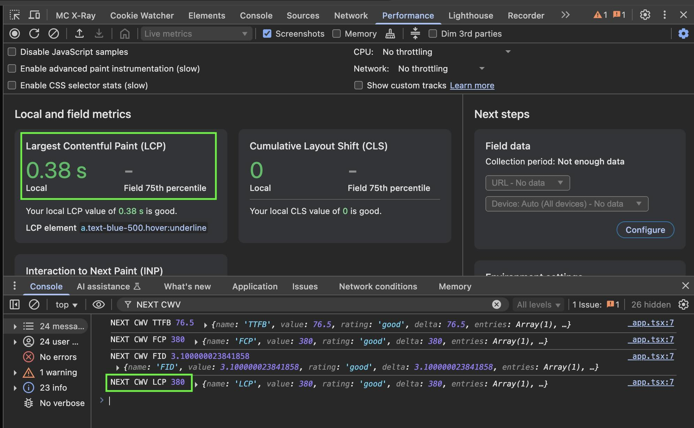
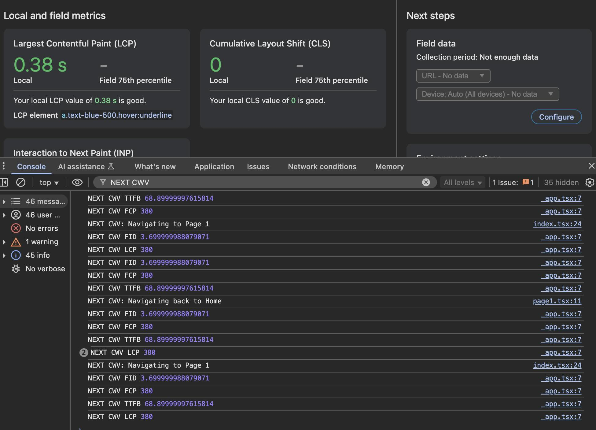

# Core Web Vitals repro

**Issue**: Using the `useReportWebVitals` hook imported from `next/web-vitals` seems to emit duplicate measurements after NextJS soft navigations.

## Steps to reproduce

1. After cloning the repo and installing deps, use `npm run dev` to start the development server.
2. Open [http://localhost:3000](http://localhost:3000) with your browser to see the website.
3. Open the console and see the CWV events that were emitted by the `useReportWebVitals` hook.
4. While you're still on the initial page, click anywhere to cause `web-vitals` to stop listening for LCP candidates

   - It is **expected** for an LCP web vital measurement to be emitted.
   - The value of the LCP measurement should be the same as the Google Chrome performance console reports.
     

5. On the webpage, click "Go to page 1".
   - Since this was implemented with `next/link`, this causes a client-side page transition, which is a **soft navigation**.
   - **BUG**: In the console, observe that several new web vital events were emitted, including TTFB and LCP.
     
   - **Expected**: after the initial LCP event, no further LCP events should be emitted.
   - **Actual**: the initial LCP event is emitted, and soft navigations cause duplicate LCP events to be emitted. Note that the subsequent LCP events have the exact same value as the initial event, which may bias RUM measurements.
   - The same erroneous firing and duplication applies for other CWV measurements like TTFB, FCP, INP, CLS, etc.
